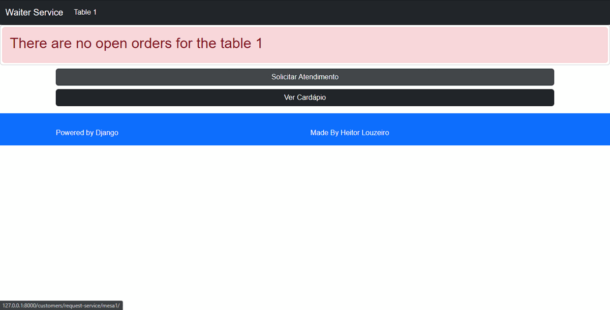

<!-- Improved compatibility of back to top link: See: https://github.com/othneildrew/Best-README-Template/pull/73 -->
<a name="top"></a>
<!--
*** Thanks for checking out the Best-README-Template. If you have a suggestion
*** that would make this better, please fork the repo and create a pull request
*** or simply open an issue with the tag "enhancement".
*** Don't forget to give the project a star!
*** Thanks again! Now go create something AMAZING! :D
-->


<!-- PROJECT SHIELDS -->
<!--
*** I'm using markdown "reference style" links for readability.
*** Reference links are enclosed in brackets [ ] instead of parentheses ( ).
*** See the bottom of this document for the declaration of the reference variables
*** for contributors-url, forks-url, etc. This is an optional, concise syntax you may use.
*** https://www.markdownguide.org/basic-syntax/#reference-style-links
-->
[![Contributors][contributors-shield]][contributors-url]
[![Forks][forks-shield]][forks-url]
[![Stargazers][stars-shield]][stars-url]
[![Issues][issues-shield]][issues-url]
[![MIT License][license-shield]][license-url]
[![LinkedIn][linkedin-shield]][linkedin-url]


<!-- PROJECT LOGO -->
<br/>
<h3 align="center">Waiter Service</h3>
  <p align="center">
    <br/>
    <br />
    <a href="https://github.com/HeitorLouzeiro/waiter-service/issues">Report Bug</a>
    ·
    <a href="https://github.com/HeitorLouzeiro/waiter-service/issues">Request Feature</a>
  </p>
</div>


<!-- TABLE OF CONTENTS -->
<details>
  <summary>Table of Contents</summary>
  <ol>
    <li>
      <a href="#about-the-project">About The Project</a>
      <ul>
        <li><a href="#built-with">Built With</a></li>
      </ul>
    </li>
    <li><a href="#usage">Usage</a></li>
    <li>
      <a href="#getting-started">Getting Started</a>
      <ul>
        <li><a href="#prerequisites">Prerequisites</a></li>
        <li><a href="#installation">Installation</a></li>
      </ul>
    </li>
    <li><a href="#roadmap">Roadmap</a></li>
    <li><a href="#contributing">Contributing</a></li>
    <li><a href="#collaborators">Collaborators</a></li>
    <li><a href="#license">License</a></li>
    <li><a href="#contact">Contact</a></li>
    <li><a href="#acknowledgments">Acknowledgments</a></li>
  </ol>
</details>


<!-- ABOUT THE PROJECT -->
## About The Project

The “Waiter” project is a platform developed using Django, HTML, CSS, Bootstrap and jQuery technologies, created with the objective of helping establishments. This application includes a set of features and functionalities that provide customers with a better experience and waiters with an efficient tool to manage the service.

The platform offers a safe and practical login process for waiters, with a password recovery option, ensuring quick and easy access to their accounts. Once logged in, waiters are directed to an exclusive page where they can view and manage their activities.

In the waiter's environment there is the possibility to create new orders, allowing the selection of menu items and the specification of additional details as needed. Waiters also have the possibility to update the status of the products in the system, providing information about the progress of the order.

The platform offers a complete view of the menu, allowing servers to consult and provide detailed information about dishes to customers, contributing to a more informed dining experience. In addition, waiters have access to customer requests and commands, allowing them to respond promptly to customer needs.

With the order tracking system, waiters can check the current status of each order, from creation to delivery, providing a comprehensive view of the workflow.

Finally, the platform provides the option to request the closing of the order, providing the customer with a convenient way to end their stay at the establishment. This streamlines the checkout process and helps servers organize and close bills.

In short, the “Waiter” project is a complete solution that improves service in gastronomic establishments. With features such as login for waiters, password recovery, exclusive management page, order creation, order status update, menu view, order and order tracking, service request and order closing, this platform offers a dynamic experience and efficient for both customers and waiters, raising service quality and overall customer satisfaction.


<p align="right">(<a href="#top">back to top</a>)</p>


### Built With

* [![Python][Python]][Python-url]
* [![Django][Django]][Django-url]
* [![SQLite][SQLite]][SQLite]
* [![Bootstrap][Bootstrap.com]][Bootstrap-url]
* [![HTML][HTML]][HTML-url]
* [![CSS][CSS]][CSS-url]
* [![JQuery][JQuery.com]][JQuery-url]

<p align="right">(<a href="#top">back to top</a>)</p>

<!-- USAGE EXAMPLES -->
<h2> Project </h2>
<p align="center">
      
    <br/>
</p>

## Usage


  ### 1. Waiter login page.

<p align="center">
      
    <br/>
</p>

  ### 2. Reset Waiter Password.
<p align="center">
    
    <br/>
</p>

  ### 3. Waiter Home Page. 
<p align="center">
    
    <br/>
</p>

  ### 4. Home customer. 
<p align="center">
    
    <br/>
</p>

  ### 5. Customer menu. 
<p align="center">
    
    <br/>
</p>
    
  ### 6. Customer service request. 
<p align="center">
    
    <br/>
</p>

  ### 7. Home page with the command created. 
<p align="center">
    
    <br/>
</p>

  ### 8. Create order in the waiter area. 
<p align="center">
    
    <br/>
</p>

  ### 9. Confirm Order. 
<p align="center">
    
    <br/>
</p>

  ### 10. Customer Order View. 
<p align="center">
    
    <br/>
</p>

  ### 11. Status Order.


<p align="center">
    
    <br/>
</p>

* Message order Ready
<p align="center">
    
    <br/>
</p>  

* Status order Delivery
<p align="center">
    
    <br/>
</p>

* Message order Delivery
<p align="center">
    
    <br/>
</p>


### Prerequisites

* [Python](https://www.python.org/)

<!-- GETTING STARTED -->
## Getting Started
### Installation

1. Clone the repo
   ```sh
   git clone https://github.com/HeitorLouzeiro/waiter-service.git
   ```
2. Access the project folder in terminal/cmd
   ```sh
   cd waiter-service
   ```
3. Create a virtualenv with Python 3.9.0.
   ```sh
   python -m venv venv
   ```
4. Activate virtualenv.
    * Ubunto
    ```sh
    source venv/bin/activate
    ```

    * MacOs
    ```sh
    source venv/bin/activate
    ```

    * Windows 
    ```sh
     venv\scripts\activate
    ```

5. Install as dependencies.
    ```sh
     pip install -r requirements.txt
    ```

6. Configure an instance with .env.
    ```sh
     cp env-example .env
    ```
    or

    Copy the env-example to a new file called .env and then open it and change the variable values ​​if necessary

7.  Change the .env variables, put your email and gmail password, if you have two-factor security follow the tutorial below.
   * [Support Google](https://support.google.com/accounts/answer/185833?hl=pt-BR)
   
    
8. Run the migrations.
    ```sh
     python manage.py migrate
    ```

9. Create a Superuser.
    ```sh
     python manage.py createsuperuser
    ``` 
10. Create itens
    ```sh
     python manage.py create_itens
    ``` 

11. Run the application.
    ```sh
     python manage.py runserver
    ```
12. Accessing the page of the garcom
    ```sh
     http://127.0.0.1:8000/

    ```

13. Accessing customer home.
    ```sh
     http://127.0.0.1:8000/customers/table/table1/
    ```


<p align="right">(<a href="#top">back to top</a>)</p>


<!-- ROADMAP -->
## Roadmap

- [x] Login Waiter
- [x] Waiter Password Recovery
- [x] Waiter's Page
- [x] Create order
- [x] Product status update.
- [x] View menu
- [x] View Commands
- [x] View order status
- [x] Request service
- [x] Request order closure


See the [open issues](https://github.com/HeitorLouzeiro/waiter-service/issues) for a full list of proposed features (and known issues).

<p align="right">(<a href="#top">back to top</a>)</p>

<!-- CONTRIBUTING -->
## Contributing

Contributions are what make the open source community such an amazing place to learn, inspire, and create. Any contributions you make are **greatly appreciated**.

If you have a suggestion that would make this better, please fork the repo and create a pull request. You can also simply open an issue with the tag "enhancement".
Don't forget to give the project a star! Thanks again!

1. Fork the Project
2. Create your Feature Branch (`git checkout -b feature/Improvements`)
3. Commit your Changes (`git commit -m 'Add my new Enhancements'`)
4. Push to the Branch (`git push origin feature/Improvements`)
5. Open a Pull Request

<p align="right">(<a href="#top">back to top</a>)</p>

## Collaborators

We thank the following people who contributed to this project:

<table>
  <tr>
    <td align="center">
      <a href="#">
        <br>
        <sub>
          <b>Heitor Louzeiro</b>
        </sub>
      </a>
    </td>
  </tr>
</table>

<p align="right">(<a href="#top">back to top</a>)</p>


<!-- LICENSE -->
## License

Distributed under the MIT License. See [LICENSE](LICENSE) for more information.

<p align="right">(<a href="#top">back to top</a>)</p>


<!-- CONTACT -->
## Contact

<div align='center'>  
  <a href="https://www.instagram.com/heitorlouzeiro/" target="_blank">
    
  </a> 
  <a href = "mailto:heitorlouzeirodev@gmail.com">
        
  </a>
  <a href="https://www.linkedin.com/in/heitor-louzeiro/" target="_blank">
    
  </a> 
</div>

Project Link: [https://github.com/HeitorLouzeiro/waiter-service](https://github.com/HeitorLouzeiro/waiter-service)

<p align="right">(<a href="#top">back to top</a>)</p>


<!-- MARKDOWN LINKS & IMAGES -->
<!-- https://www.markdownguide.org/basic-syntax/#reference-style-links -->
[contributors-shield]: https://img.shields.io/github/contributors/HeitorLouzeiro/waiter-service.svg?style=for-the-badge
[contributors-url]: https://github.com/HeitorLouzeiro/waiter-service/graphs/contributors
[forks-shield]: https://img.shields.io/github/forks/HeitorLouzeiro/waiter-service.svg?style=for-the-badge
[forks-url]: https://github.com/HeitorLouzeiro/waiter-service/network/members
[stars-shield]: https://img.shields.io/github/stars/HeitorLouzeiro/waiter-service.svg?style=for-the-badge
[stars-url]: https://github.com/HeitorLouzeiro/waiter-service/stargazers
[issues-shield]: https://img.shields.io/github/issues/HeitorLouzeiro/waiter-service.svg?style=for-the-badge
[issues-url]: https://github.com/HeitorLouzeiro/waiter-service/issues
[license-shield]: https://img.shields.io/github/license/HeitorLouzeiro/waiter-service.svg?style=for-the-badge
[license-url]: https://github.com/HeitorLouzeiro/waiter-service/blob/master/license
[linkedin-shield]: https://img.shields.io/badge/-LinkedIn-black.svg?style=for-the-badge&logo=linkedin&colorB=555
[linkedin-url]: https://linkedin.com/in/heitor-louzeiro

[Python]: https://img.shields.io/badge/Python-14354C?style=for-the-badge&logo=python&logoColor=white
[Python-url]: https://www.python.org/

[Django]: https://img.shields.io/badge/Django-092E20?style=for-the-badge&logo=django&logoColor=white
[Django]: https://img.shields.io/badge/Django-092E20?style=for-the-badge&logo=django&logoColor=white
[Django-url]: https://www.djangoproject.com/

[SQLite]: https://img.shields.io/badge/SQLite-07405E?style=for-the-badge&logo=sqlite&logoColor=white
[SQLite-url]: https://www.sqlite.org/index.html

[Bootstrap.com]: https://img.shields.io/badge/Bootstrap-563D7C?style=for-the-badge&logo=bootstrap&logoColor=white
[Bootstrap-url]: https://getbootstrap.com

[HTML]:https://img.shields.io/badge/HTML5-E34F26?style=for-the-badge&logo=html5&logoColor=white
[HTML-url]: https://github.com/HeitorLouzeiro/waiter-service/#

[CSS]: 	https://img.shields.io/badge/CSS-239120?&style=for-the-badge&logo=css3&logoColor=white
[CSS-url]: https://github.com/HeitorLouzeiro/waiter-service/#

[JQuery.com]: https://img.shields.io/badge/jQuery-0769AD?style=for-the-badge&logo=jquery&logoColor=white
[JQuery-url]: https://jquery.com
